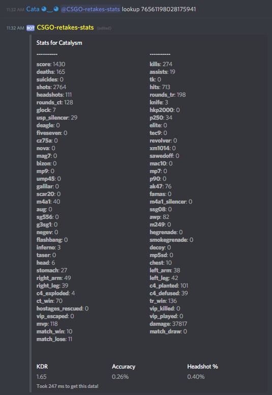
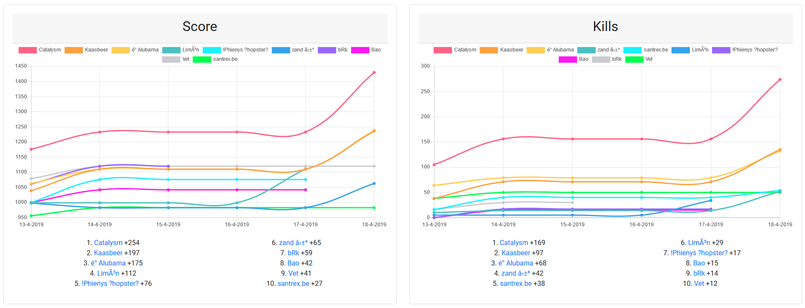

# CSGO RankMe stats

This application shows statistics from [Kento RankMe plugin](https://github.com/rogeraabbccdd/Kento-Rankme)

This includes:
 - A Discord bot.
 - A webserver

## [Installation](https://github.com/niekcandaele/CSGO-RankMe-Discord/wiki/Installation)

You will need a MySQL database that is storing the statistics. Atleast NodeJs v8.x is required. 

## Documentation

There is [autogenerated documentation](https://niekcandaele.github.io/CSGO-RankMe-stats/) about the code available. For info on how to use, please refer to [the wiki](https://github.com/niekcandaele/CSGO-RankMe-stats/wiki)

## Support

For bug reports or other code-related problems, please [make an issue](https://github.com/niekcandaele/CSGO-RankMe-Discord/issues/new).

If you are having trouble installing the application, you can [join my discord server](http://catalysm.net/discord).

## Examples

[My retake servers stats](https://retakes.catalysm.net/)

### Discord

 

### Website

#### Player profile

#### Most increase in score and kills

