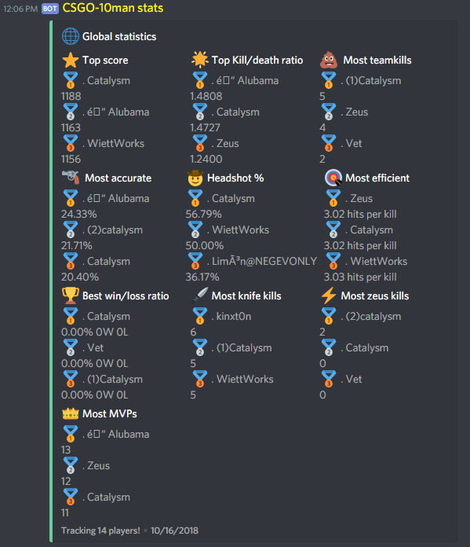
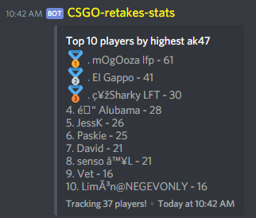
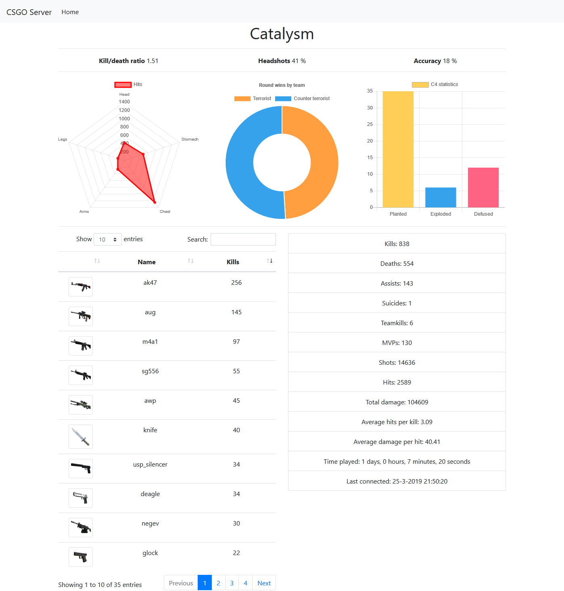

# CSGO RankMe stats

This application shows statistics from [Kento RankMe plugin](https://github.com/rogeraabbccdd/Kento-Rankme)

This includes:
 - A Discord bot.
 - A webserver

## Installation

You will need a MySQL database that is storing the statistics, this bot does not support SQLite (yet). Atleast NodeJs v8.x is recommended. 

[Guide](https://github.com/niekcandaele/CSGO-RankMe-Discord/wiki/Installation)

## Support

For bug reports or other code-related problems, please [make an issue](https://github.com/niekcandaele/CSGO-RankMe-Discord/issues/new).

If you are having trouble installing the application, you can [join my discord server](http://catalysm.net/discord).

## Examples

 

